<div align="center">

# 📚 ECIEXPRESS — Microservicio de Pagos

### *"Sin filas, sin estrés, ECIEXPRESS"*

---

### 🛠️ Stack Tecnológico


### ☁️ Infraestructura & Calidad


### 🏗️ Arquitectura


</div>

---

## 📑 Tabla de Contenidos

1. [👤 Integrantes](#1--integrantes)
2. [🎯 Objetivo del Microservicio](#2--objetivo-del-microservicio)
3. [⚡ Funcionalidades Principales](#3--funcionalidades-principales)
4. [📋 Estrategia de Versionamiento y Branches](#4--manejo-de-estrategia-de-versionamiento-y-branches)
   - [4.1 Convenciones para crear ramas](#41-convenciones-para-crear-ramas)
   - [4.2 Convenciones para crear commits](#42-convenciones-para-crear-commits)
5. [⚙️ Tecnologías Utilizadas](#5--tecnologias-utilizadas)
6. [🧩 Funcionalidad](#6--funcionalidades)
7. [📊 Diagramas](#7--diagramas)
8. [⚠️ Manejo de Errores](#8--manejo-de-errores)
9. [🧪 Evidencia de Pruebas y Ejecución](#9--evidencia-de-las-pruebas-y-como-ejecutarlas)
10. [🗂️ Organización del Código](#10--codigo-de-la-implementacion-organizado-en-las-respectivas-carpetas)
11. [🚀 Ejecución del Proyecto](#11--ejecución-del-proyecto)
12. [☁️ CI/CD y Despliegue en Azure](#12--cicd-y-despliegue-en-azure)
13. [🤝 Contribuciones y Metodología](#13--contribuciones-y-metodologia)

---

## 1. 👤 Integrantes:

- Elizabeth Correa
- Daniel Palacios
- David Salamanca
- Tomas Ramirez
- Carolina Cepeda

## 2. 🎯 Objetivo del microservicio

El microservicio de Pagos tiene como objetivo procesar de forma segura, eficiente y trazable todas las transacciones económicas dentro de ECIExpress, permitiendo a los usuarios pagar sus pedidos mediante efectivo, billetera virtual o medios bancarios. Este servicio centraliza la lógica financiera del sistema, aplicando promociones, validando métodos de pago, integrándose con gateways externos (como PayU) y generando la información necesaria para la emisión de comprobantes digitales.

Asimismo, garantiza la coherencia del flujo de compra colaborando con otros microservicios Pedidos, Billetera, Promociones y Recibosbpara asegurar que cada transacción sea consistente, auditable y actualice correctamente el estado del pedido. De este modo, el microservicio contribuye a la digitalización de los procesos de pago dentro del campus y a la reducción de tiempos de espera en cafeterías y papelerías universitarias.

---

## 3. ⚡ Funcionalidades principales

<div align="center">

<table>
  <thead>
    <tr>
      <th>💡 Funcionalidad</th>
      <th>Descripción Breve</th>
    </tr>
  </thead>
  <tbody>
    <tr>
      <td><strong>Pagos Multicanal</strong></td>
      <td>Procesa pagos por efectivo, billetera o banco.</td>
    </tr>
    <tr>
      <td><strong>Promociones Automáticas</strong></td>
      <td>Aplica descuentos y recalcula el monto final.</td>
    </tr>
    <tr>
      <td><strong>Validación Bancaria</strong></td>
      <td>Verifica datos bancarios y conecta con PayU.</td>
    </tr>
    <tr>
      <td><strong>Recibos Digitales</strong></td>
      <td>Genera y envía comprobantes de pago.</td>
    </tr>
    <tr>
      <td><strong>Integración con Microservicios</strong></td>
      <td>Sincroniza con Wallet, Promociones y Recibos.</td>
    </tr>
    <tr>
      <td><strong>Estados de Pago</strong></td>
      <td>PENDING, PROCESSING, COMPLETED, FAILED, REFUNDED.</td>
    </tr>
    <tr>
      <td><strong>Manejo de Errores</strong></td>
      <td>Respuestas claras y consistentes.</td>
    </tr>
  </tbody>
</table>

</div>

## 4. 📋 Manejo de Estrategia de versionamiento y branches

### Estrategia de Ramas (Git Flow)

### Ramas y propósito
- Manejaremos GitFlow, el modelo de ramificación para el control de versiones de Git

#### `main`
- **Propósito:** rama **estable** con la versión final (lista para demo/producción).
- **Reglas:**
    - Solo recibe merges desde `release/*` y `hotfix/*`.
    - Cada merge a `main` debe crear un **tag** SemVer (`vX.Y.Z`).
    - Rama **protegida**: PR obligatorio, 1–2 aprobaciones, checks de CI en verde.

#### `develop`
- **Propósito:** integración continua de trabajo; base de nuevas funcionalidades.
- **Reglas:**
    - Recibe merges desde `feature/*` y también desde `release/*` al finalizar un release.
    - Rama **protegida** similar a `main`.

#### `feature/*`
- **Propósito:** desarrollo de una funcionalidad, refactor o spike.
- **Base:** `develop`.
- **Cierre:** se fusiona a `develop` mediante **PR**


#### `release/*`
- **Propósito:** congelar cambios para estabilizar pruebas, textos y versiones previas al deploy.
- **Base:** `develop`.
- **Cierre:** merge a `main` (crear **tag** `vX.Y.Z`) **y** merge de vuelta a `develop`.
- **Ejemplo de nombre:**  
  `release/1.3.0`

#### `hotfix/*`
- **Propósito:** corregir un bug **crítico** detectado en `main`.
- **Base:** `main`.
- **Cierre:** merge a `main` (crear **tag** de **PATCH**) **y** merge a `develop` para mantener paridad.
- **Ejemplos de nombre:**  
  `hotfix/fix-blank-screen`, `hotfix/css-broken-header`


---

### 4.1 Convenciones para **crear ramas**

#### `feature/*`
**Formato:**
```
feature/[nombre-funcionalidad]-ECIExpress_[codigo-jira]
```

**Ejemplos:**
- `feature/readme_ECIExpress-34`

**Reglas de nomenclatura:**
- Usar **kebab-case** (palabras separadas por guiones)
- Máximo 50 caracteres en total
- Descripción clara y específica de la funcionalidad
- Código de Jira obligatorio para trazabilidad

#### `release/*`
**Formato:**
```
release/[version]
```
**Ejemplo:** `release/1.3.0`

#### `hotfix/*`
**Formato:**
```
hotfix/[descripcion-breve-del-fix]
```
**Ejemplos:**
- `hotfix/corregir-pantalla-blanca`
- `hotfix/arreglar-header-responsive`

---

### 4.2 Convenciones para **crear commits**

#### **Formato:**
```
[codigo-jira] [tipo]: [descripción específica de la acción]
```

#### **Tipos de commit:**
- `feat`: Nueva funcionalidad
- `fix`: Corrección de errores
- `docs`: Cambios en documentación


## 5. ⚙️ Tecnologías Utilizadas

> 🧠 **Stack tecnológico seleccionado** para asegurar **escalabilidad**, **modularidad**, **seguridad**, **trazabilidad** y **mantenibilidad**, aplicando buenas prácticas de ingeniería de software.

| **Tecnología / Herramienta** | **Uso principal en el proyecto** |
|------------------------------|----------------------------------|
| **Java OpenJDK** | Lenguaje de programación base de los microservicios backend, orientado a objetos y multiplataforma. |
| **Spring Boot** | Framework principal para construir microservicios independientes, exponiendo APIs REST y gestionando configuración e inyección de dependencias. |
| **Spring Web** | Exposición de endpoints REST en cada microservicio (controladores HTTP) dentro de la arquitectura hexagonal. |
| **Spring Security** | Configuración de autenticación y autorización mediante roles, asegurando el acceso a los endpoints de los microservicios. |
| **Spring Data MongoDB** | Integración de cada microservicio con su base de datos NoSQL en MongoDB usando el patrón Repository y puertos/adaptadores. |
| **MongoDB Atlas** | Base de datos NoSQL en la nube, con colecciones independientes por dominio (pagos, billetera, recibos, promociones, usuarios, etc.). |
| **Apache Maven** | Gestión de dependencias, empaquetado de cada microservicio y automatización de builds en los pipelines CI/CD. |
| **Lombok** | Reducción de código repetitivo en los microservicios con anotaciones como `@Getter`, `@Setter`, `@Builder` y `@AllArgsConstructor`. |
| **JUnit 5** | Framework de pruebas unitarias para validar la lógica de dominio y casos de uso en cada microservicio. |
| **Mockito** | Simulación de dependencias (puertos, repositorios, clientes externos) en pruebas unitarias sin acceder a infraestructura real. |
| **JaCoCo** | Generación de reportes de cobertura de código de los microservicios para evaluar la efectividad de las pruebas. |
| **SonarQube** | Análisis estático del código y control de calidad, identificando vulnerabilidades, code smells y problemas de mantenibilidad. |
| **Swagger (OpenAPI 3)** | Generación automática de documentación y prueba interactiva de los endpoints REST de cada microservicio. |
| **Postman** | Entorno de pruebas de la API para validar manualmente las peticiones y respuestas JSON de los distintos microservicios (`POST`, `GET`, `PATCH`, `DELETE`). |
| **Docker** | Contenerización de cada microservicio para garantizar despliegues aislados y consistentes entre entornos. |
| **Azure App Service** | Entorno de ejecución en la nube donde se despliegan los contenedores Docker de los microservicios. |
| **Azure Container Registry (ACR)** | Almacenamiento y versionado de las imágenes Docker generadas en los pipelines de CI/CD. |
| **GitHub Actions** | Pipelines de integración y despliegue continuo (CI/CD) para compilar, probar, analizar y desplegar cada microservicio. |
| **AWS API Gateway** | Punto de entrada único al backend que enruta las solicitudes del cliente al microservicio correspondiente (Pagos, Wallet, Recibos, QR, etc.). |
| **AWS Lambda (Node.js)** | Funciones ligeras que actúan como lógica intermedia cuando se requiere preprocesar o adaptar solicitudes antes de enviarlas a los microservicios. |
| **SSL / HTTPS** | Cifrado de la comunicación entre cliente, API Gateway y microservicios para garantizar la seguridad de la información. |


## 6. 🧩 Funcionalidades

El backend de **ECIExpress** implementa un **sistema de gestión de pagos** que facilita la transacción económica entre usuarios y el sistema.

---

### 🔑 Funcionalidades principales

### 1️⃣ Procesamiento de Pagos: Estrategias y Flujo

El microservicio procesa pagos según el método seleccionado por el cliente (Efectivo, Banco o Billetera), aplicando promociones y generando el recibo correspondiente.

**Endpoint principal:**  
`POST /api/v1/payments/ProcessPayment`

---

### 🚦 Estrategias de Pago Implementadas

<div align="center">

| 💳 **Método** | 📝 **Descripción** |
|:-------------:|:------------------|
| <b>CASH (Efectivo)</b> | Pago directo, sin validaciones bancarias. |
| <b>BANK (Bancario)</b> | Validación de datos bancarios y procesamiento con PayU. |
| <b>WALLET (Billetera)</b> | Integración con el servicio de billetera digital. |

</div>

---

### 🧭 Flujos de Procesamiento

<details>
<summary><strong>🟢 Estrategia CASH (Efectivo)</strong></summary>

1. El cliente envía una solicitud de pago al controlador.
2. El controlador delega al servicio de pagos, que selecciona la estrategia CASH.
3. Se consulta el servicio de promociones para obtener descuentos aplicables.
4. Se calcula el monto final y se crea el objeto de pago en efectivo.
5. Se genera el recibo a través del servicio externo de recibos.
6. Se retorna la respuesta con el ID del recibo y el monto final al cliente.

</details>

<details>
<summary><strong>🔵 Estrategia BANK (Bancario)</strong></summary>

1. El cliente envía una solicitud de pago con datos bancarios.
2. El controlador delega al servicio de pagos, que selecciona la estrategia BANK.
3. Se validan los datos bancarios (algoritmo de Luhn, fecha de expiración, CVV).
4. Si la validación es exitosa:
    - Se consultan las promociones disponibles.
    - Se procesa el pago con el gateway PayU.
    - PayU retorna la respuesta de aprobación/rechazo.
    - Se crea el objeto de pago bancario.
    - Se genera el recibo.
5. Si la validación falla: Se retorna error 400 inmediatamente.

</details>

<details>
<summary><strong>🟠 Estrategia WALLET (Billetera)</strong></summary>

1. El cliente envía una solicitud de pago con billetera digital.
2. El controlador delega al servicio de pagos, que selecciona la estrategia WALLET.
3. Se consultan las promociones disponibles.
4. Se procesa el pago con el servicio de billetera (verifica saldo y realiza el débito).
5. El servicio de billetera retorna el estado del pago.
6. Se crea el objeto de pago con billetera.
7. Se genera el recibo correspondiente.
8. Se retorna la respuesta al cliente.

</details>

---

### 📦 Estructura de la Solicitud (Request)

<div align="center">

| 🏷️ Campo              | 🗃️ Tipo   | 🟢 Obligatorio | 📝 Descripción                      |
|-----------------------|-----------|:-------------:|-------------------------------------|
| orderId               | String    | Sí            | Identificador de la orden           |
| clientId              | String    | Sí            | Identificador del cliente           |
| storeId               | String    | Sí            | Identificador de la tienda          |
| originalAmount        | Double    | Sí            | Monto antes de promociones          |
| paymentMethod.type    | Enum      | Sí            | CASH, WALLET o BANK                 |
| bankDetails           | Object    | Solo BANK     | Datos bancarios (si aplica)         |

</div>

---

### 📦 Estructura de la Respuesta (Response)

<div align="center">

| 🏷️ Campo        | 🗃️ Tipo   | 📝 Descripción                      |
|-----------------|-----------|-------------------------------------|
| receiptId       | String    | ID del recibo generado              |
| orderId         | String    | ID de la orden procesada            |
| storeId         | String    | ID de la tienda                     |
| finalAmount     | Double    | Monto final con descuentos          |
| receiptStatus   | Enum      | PAYED, PENDING o REFUNDED           |

</div>

---

### ✅ Happy Path (Ejemplo de Uso Exitoso)

A continuación se muestra un ejemplo de una solicitud exitosa para un pago en efectivo (**CASH**), donde el flujo se completa correctamente.

**Request (Solicitud):**
```json
POST /api/v1/payments/ProcessPayment
{
  "orderId": "ORD-2025-001",
  "clientId": "CLIENT-123",
  "storeId": "STORE-ABC",
  "originalAmount": 15000.0,
  "paymentMethod": {
    "type": "CASH"
  }
}
```

**Response (Respuesta):**
```json
200 OK
{
  "receiptId": "REC-998877",
  "orderId": "ORD-2025-001",
  "storeId": "STORE-ABC",
  "finalAmount": 15000.0,
  "receiptStatus": "PENDING"
}
```

> **Nota:** En este flujo, el sistema recibió la orden, calculó el monto y generó un recibo en estado `PENDING` listo para ser pagado en caja.

---

### 🖼️ Diagramas de Secuencia

- **CASH:**  

  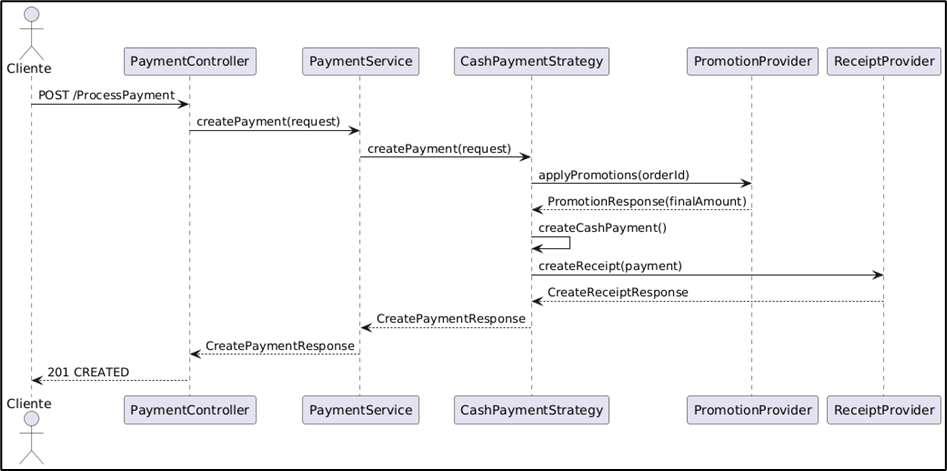


- **BANK:**  

  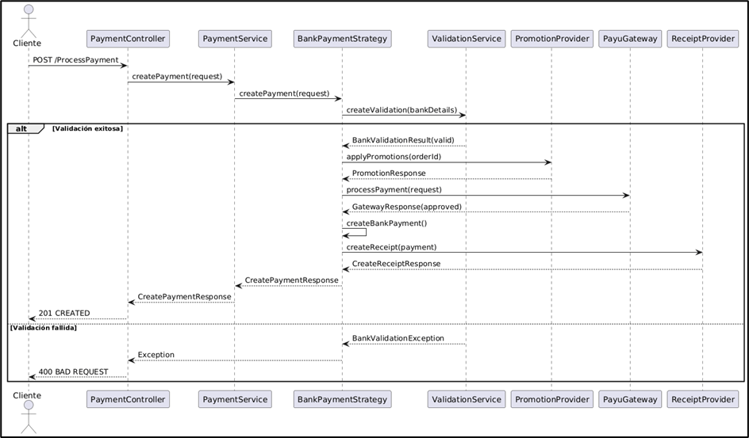

- **WALLET:**  

  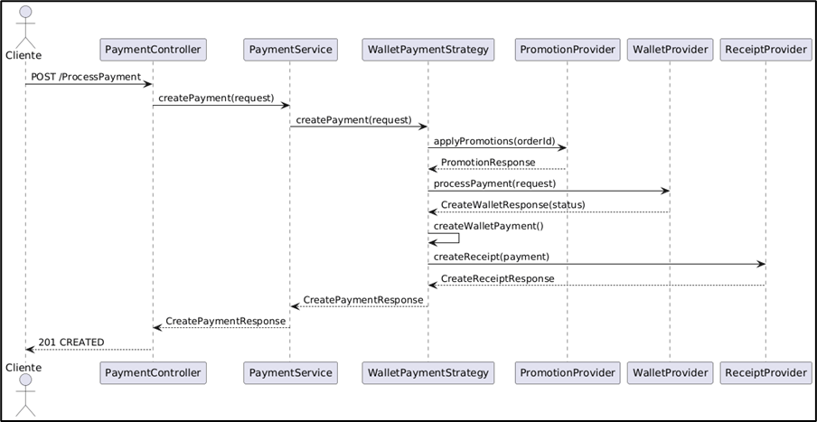

---

> Cada estrategia encapsula su lógica, permitiendo agregar nuevos métodos de pago sin modificar el código existente y garantizando un flujo seguro, auditable y eficiente.

---

## 7. 📊 Diagramas

Esta sección muestra los diagramas clave del microservicio de pagos, ilustrando su arquitectura, componentes principales y despliegue.

---

### 🏗️ Diagrama de Componentes — Vista General
<div align="center">
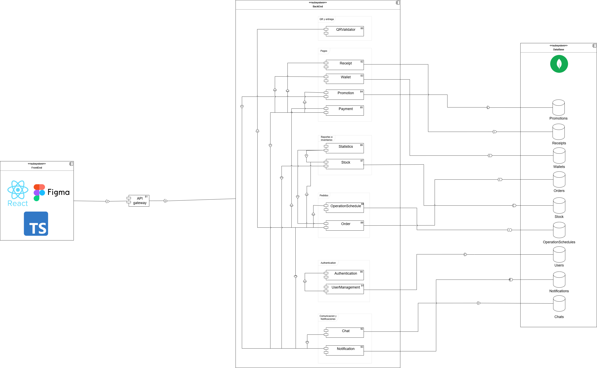
</div>


---

### 🔍 Diagrama de Componentes — Vista Específica

<div align="center">
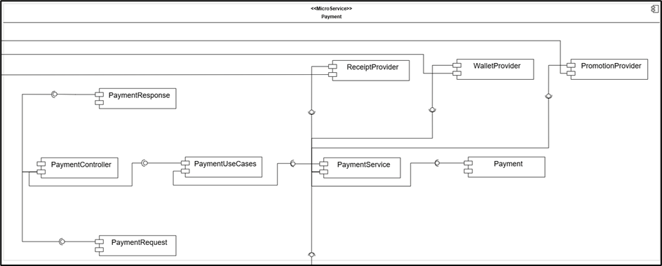
</div>

**Arquitectura Hexagonal:**  
El microservicio de Pagos separa controladores, casos de uso, lógica de negocio y adaptadores externos para mantener modularidad y escalabilidad.

**Flujo principal:**

- **PaymentController**
  - Recibe la solicitud `CreatePaymentRequest`.
  - Delegación al servicio de pagos (`PaymentService`), que orquesta el proceso.

**Estrategias de Pago:**

- **🟢 CashPaymentStrategy**
  - Aplica promociones.
  - Genera el recibo sin validaciones adicionales.

- **🔵 BankPaymentStrategy**
  - Valida datos bancarios (Luhn, CVV, expiración).
  - Calcula un risk score.
  - Procesa la transacción con PayU mediante `PayuBankGatewayAdapter`.
  - Genera el recibo.

- **🟠 WalletPaymentStrategy**
  - Verifica saldo con `WalletProvider`.
  - Aplica promociones.
  - Genera el recibo.

**Integración y Adaptadores:**

- **Ports:**  
  - `PromotionProvider`, `ReceiptProvider`, `BankGatewayProvider`, `WalletProvider`  
  Definen interfaces independientes del dominio.
- **Adapters:**  
  Implementan los puertos y conectan el servicio con APIs externas vía REST, desacoplando el dominio de detalles técnicos.

### 🔌 Servicios Externos Integrados

<div align="center">

| 🌍 **Servicio** | 📋 **Responsabilidad** |
|:---------------|:-----------------------|
| **Promotion Service** | Aplicar descuentos a órdenes |
| **Receipt Service** | Generar recibos de pago |
| **Wallet Service** | Procesar pagos con billetera |
| **PayU Gateway** | Procesar transacciones bancarias |

</div>

**Dominio y Mapeo:**

- Entidades (`Payment`, `CashPayment`, `BankPayment`, `WalletPayment`) encapsulan la lógica central.
- Contextos y DTOs gestionan los datos necesarios en cada proceso.
- `ApplicationMapper` transforma los datos entre capas, asegurando respuestas completas y correctas.


> El diagrama ilustra cómo cada estrategia de pago encapsula su lógica, permitiendo flexibilidad y facilidad de mantenimiento. La transición entre componentes y adaptadores garantiza que el microservicio pueda evolucionar e integrarse con nuevos servicios externos sin afectar la lógica de negocio.

---

### 📦 Diagrama de Clases del Dominio

<div align="center">
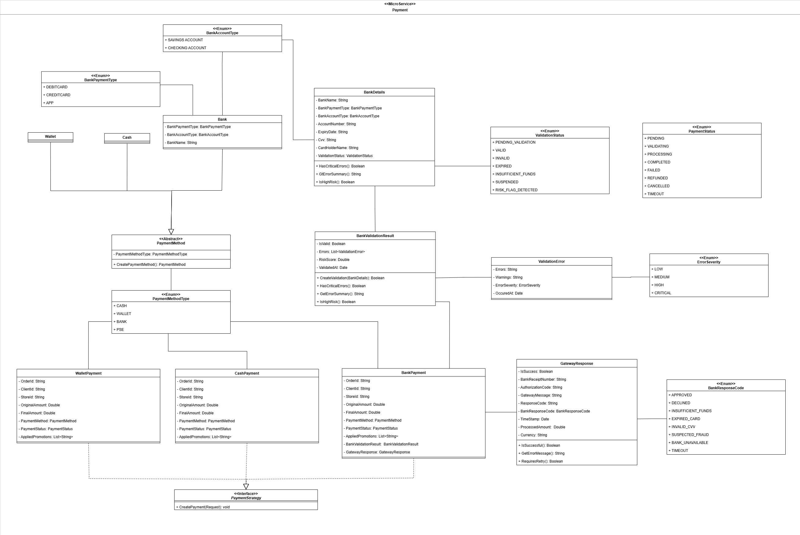
</div>

**Resumen del diseño de dominio:**

- El microservicio aplica **Arquitectura Hexagonal**, separando dominio, lógica de aplicación e infraestructura.
- La entidad central es **Payment** (abstracta), de la que derivan:
  - **CashPayment**: pagos en efectivo.
  - **BankPayment**: pagos bancarios con validación y uso de PayU.
  - **WalletPayment**: pagos con billetera digital.
- Cada tipo de pago incluye solo la información necesaria para su proceso:
  - *BankPayment* almacena validaciones y la respuesta del gateway.
  - *CashPayment* no requiere datos adicionales.
- El patrón **Strategy** permite que cada estrategia (`CashPaymentStrategy`, `BankPaymentStrategy`, `WalletPaymentStrategy`) encapsule su propia lógica:
  - Validaciones
  - Integración con servicios externos
  - Generación de recibos
- El patrón **Adapter** facilita la comunicación con servicios externos:
  - `PayuBankGatewayAdapter` para PayU
  - `PromotionProviderAdapter` para promociones
  - `ReceiptProviderAdapter` para recibos
  - `WalletProviderAdapter` para billetera
- Los adaptadores desacoplan el dominio de detalles técnicos (HTTP, infraestructura).
- La validación bancaria se realiza con **ValidationService**:
  - Algoritmo de Luhn, fechas, CVV, risk score.
  - Resultado encapsulado en `BankValidationResult` (lista de errores y severidad).
- Los objetos de dominio (`BankDetails`, `GatewayResponse`, `TimeStamps`, `ValidationError`) siguen el principio de responsabilidad única.
- El record **Context** agrupa la información necesaria para crear un pago, facilitando la comunicación ordenada entre capas.


> Este diseño permite agregar nuevos métodos de pago y servicios externos sin modificar la lógica existente, asegurando flexibilidad, mantenibilidad y trazabilidad en todas las transacciones.

---


### 📦 DTOs Principales

<div align="center">
<div style="background:#111; color:#fff; border-radius:12px; padding:24px 12px; box-shadow:0 2px 12px #0002;">

<table style="border:2px solid #4A90E2; border-radius:8px;">
  <caption style="font-size:1.15em; font-weight:bold; color:#4A90E2; padding:8px;">📨 <u>Request DTOs</u></caption>
  <thead style="background:#222; color:#fff;">
    <tr>
      <th style="padding:8px;">DTO</th>
      <th style="padding:8px;">Atributos Principales</th>
      <th style="padding:8px;">Descripción</th>
    </tr>
  </thead>
  <tbody>
    <tr>
      <td><b>CreatePaymentRequest</b></td>
      <td>orderId, clientId, storeId, originalAmount, paymentMethod, bankDetails</td>
      <td>Solicitud inicial para procesar un pago</td>
    </tr>
    <tr>
      <td><b>PromotionRequest</b></td>
      <td>orderId</td>
      <td>Consulta de promociones aplicables a una orden</td>
    </tr>
    <tr>
      <td><b>CreateReceiptRequest</b></td>
      <td>orderId, clientId, storeId, finalAmount, paymentMethod</td>
      <td>Generación de recibo de pago</td>
    </tr>
  </tbody>
</table>

<br>

<table style="border:2px solid #43A047; border-radius:8px;">
  <caption style="font-size:1.15em; font-weight:bold; color:#43A047; padding:8px;">📤 <u>Response DTOs</u></caption>
  <thead style="background:#222; color:#fff;">
    <tr>
      <th style="padding:8px;">DTO</th>
      <th style="padding:8px;">Atributos Principales</th>
      <th style="padding:8px;">Descripción</th>
    </tr>
  </thead>
  <tbody>
    <tr>
      <td><b>CreatePaymentResponse</b></td>
      <td>receiptId, orderId, storeId, finalAmount, receiptStatus</td>
      <td>Respuesta del procesamiento de pago</td>
    </tr>
    <tr>
      <td><b>PromotionResponse</b></td>
      <td>finalAmount, appliedPromotions</td>
      <td>Monto final con descuentos aplicados</td>
    </tr>
    <tr>
      <td><b>CreateReceiptResponse</b></td>
      <td>receiptId, orderId, receiptStatus</td>
      <td>Confirmación de recibo generado</td>
    </tr>
    <tr>
      <td><b>PayuPaymentResponse</b></td>
      <td>code, transactionResponse</td>
      <td>Respuesta del gateway PayU</td>
    </tr>
    <tr>
      <td><b>CreateWalletResponse</b></td>
      <td>paymentStatus</td>
      <td>Estado del pago con billetera</td>
    </tr>
  </tbody>
</table>

</div>
</div>

---


### 🗄️ Diagrama de Despliegue

<div align="center">
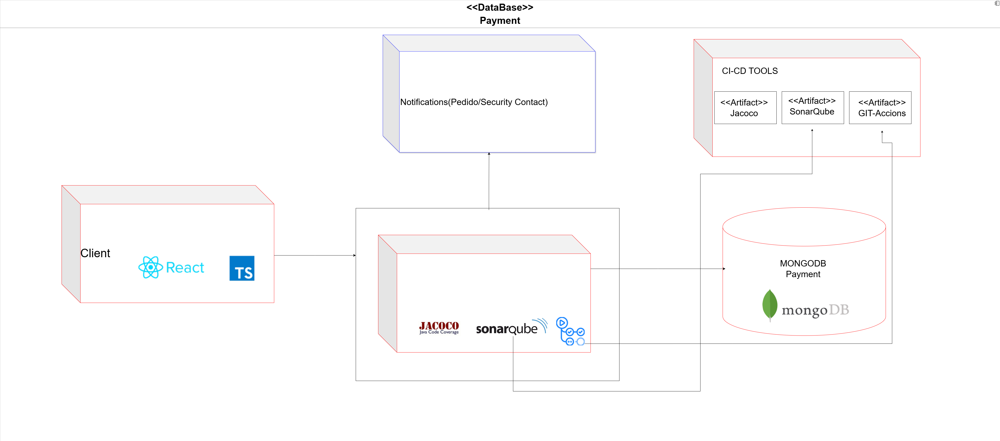
</div>

---

#### 🚀 Despliegue e Infraestructura

- El microservicio de **Pagos** se ejecuta como un contenedor Docker en **Azure App Service**.
- Las imágenes Docker se almacenan y versionan en **Azure Container Registry (ACR)**.
- El pipeline de **CI/CD** automatiza la construcción, pruebas y despliegue usando **GitHub Actions**:
  - `ci.yml`: Pruebas unitarias, cobertura y análisis de calidad en cada push/PR.
  - `cd_dev.yml`: Construcción y despliegue automático en ambiente de desarrollo.
  - `cd_prod.yml`: Despliegue automático en producción al actualizar `main`.
- El frontend (React + TypeScript) se comunica con el microservicio a través de un **API Gateway**, que gestiona enrutamiento, CORS, autenticación y balanceo de carga.
- Las peticiones llegan al contenedor en Azure, donde el servicio procesa la lógica y persiste los datos en **MongoDB Atlas** (colección `Wallets` para saldos, clientId y timestamps).
- El microservicio utiliza un **Dockerfile multi-stage**:
  - 1️⃣ Compilación con Maven.
  - 2️⃣ Ejecución con un runtime ligero (`eclipse-temurin:17-jre-alpine`).
- Para desarrollo local existe un `docker-compose.yml`.
- En producción, la configuración se gestiona con variables de entorno en Azure (`MONGODB_URI`, `SPRING_PROFILES_ACTIVE`).
- **MongoDB Atlas** garantiza alta disponibilidad, backups automáticos y acceso seguro, asegurando la confiabilidad del servicio financiero.

---

<div align="center">

| 🌐 **Componente**         | 📝 **Descripción**                                 |
|--------------------------|---------------------------------------------------|
| Azure App Service        | Hosting del contenedor Docker del microservicio   |
| Azure Container Registry | Almacenamiento y versionado de imágenes Docker    |
| GitHub Actions           | Automatización de CI/CD y calidad de código       |
| API Gateway              | Punto de entrada único para el frontend           |
| MongoDB Atlas            | Base de datos NoSQL, alta disponibilidad y backups|

</div>

---


## 8. ⚠️ Manejo de Errores

El backend de **ECIExpress** implementa un **mecanismo centralizado de manejo de errores** que garantiza uniformidad, claridad y seguridad en todas las respuestas enviadas al cliente cuando ocurre un fallo.

Este sistema permite mantener una comunicación clara entre el backend y el frontend, asegurando que los mensajes de error sean legibles, útiles y coherentes, sin exponer información sensible del servidor.

---

### 🧠 Estrategia general de manejo de errores

El sistema utiliza una **clase global** que intercepta todas las excepciones lanzadas desde los controladores REST.  
A través de la anotación `@ControllerAdvice`, se centraliza el manejo de errores, evitando el uso repetitivo de bloques `try-catch` en cada endpoint.

Cada error se transforma en una respuesta **JSON estandarizada**, que mantiene un formato uniforme para todos los tipos de fallos.


---

### ⚙️ Global Exception Handler

El **Global Exception Handler** es una clase con la anotación `@ControllerAdvice` que captura y maneja todas las excepciones del sistema.  
Utiliza métodos con `@ExceptionHandler` para procesar errores específicos y devolver una respuesta personalizada acorde al tipo de excepción.

**✨ Características principales:**

- ✅ **Centraliza** la captura de excepciones desde todos los controladores
- ✅ **Retorna mensajes JSON consistentes** con el mismo formato estructurado
- ✅ **Asigna códigos HTTP** según la naturaleza del error (400, 404, 409, 500, etc.)
- ✅ **Define mensajes descriptivos** que ayudan tanto al desarrollador como al usuario
- ✅ **Mantiene la aplicación limpia**, eliminando bloques try-catch redundantes
- ✅ **Mejora la trazabilidad** y facilita la depuración en los entornos de prueba y producción


---

### 🧩 Validaciones en DTOs

Además del manejo global de errores, el sistema utiliza **validaciones automáticas** sobre los DTOs (Data Transfer Objects) para garantizar que los datos que llegan al servidor cumplan con las reglas de negocio antes de ejecutar cualquier lógica.

Estas validaciones se implementan mediante las anotaciones de **Javax Validation** y **Hibernate Validator**, como `@NotBlank`, `@NotNull`, `@Email`, `@Min`, `@Max`, entre otras.


Si alguno de los campos no cumple las validaciones, se lanza automáticamente una excepción del tipo `MethodArgumentNotValidException`.  
Esta es capturada por el **Global Exception Handler**, que devuelve una respuesta JSON estandarizada con el detalle del campo inválido.


> 💡 Gracias a este mecanismo, se asegura que las peticiones erróneas sean detectadas desde el inicio, reduciendo fallos en capas más profundas como servicios o repositorios.

---

### 📊 Tipos de errores manejados

<div align="center">

| 🔢 **Código HTTP** | ⚠️ **Escenario** | 💬 **Mensaje de Error** |
|:------------------:|:----------------|:------------------------|
|  | Datos inválidos en la solicitud | `"Invalid input data"` |
|  | Validación bancaria fallida | `"Bank validation failed: {detalles}"` |
|  | Orden no encontrada en el sistema | `"Order not found: {orderID}"` |
|  | Fallo en gateway de pago PayU | `"Payment gateway error: {detalles}"` |
|  | Error al aplicar promociones | `"Error applying promotions for order {orderId}"` |
|  | Error al procesar recibo | `"Error processing receipt for order {orderId}"` |
|  | Error en servicio de billetera | `"Error processing wallet payment for order {orderId}"` |

</div>


---

### ✅ Beneficios del manejo centralizado

<div align="center">

| 🎯 **Beneficio** | 📋 **Descripción** |
|:-----------------|:-------------------|
| **🎯 Uniformidad** | Todas las respuestas de error tienen el mismo formato JSON estandarizado |
| **🔧 Mantenibilidad** | Agregar nuevas excepciones no requiere modificar cada controlador |
| **🔒 Seguridad** | Oculta los detalles internos del servidor y evita exponer trazas sensibles |
| **📍 Trazabilidad** | Cada error incluye información contextual (ruta, timestamp y descripción) |
| **🤝 Integración fluida** | Facilita la comunicación con frontend y herramientas como Postman/Swagger |

</div>

---

> Gracias a este enfoque, el backend de ECIExpress logra un manejo de errores **robusto**, **escalable** y **seguro**, garantizando una experiencia de usuario más confiable y profesional.

---


---

## 9. 🧪 Evidencia de las pruebas y cómo ejecutarlas

El backend de **ECIExpress** implementa una **estrategia integral de pruebas** que garantiza la calidad, funcionalidad y confiabilidad del código mediante pruebas unitarias y de integración.

---

### 🎯 Tipos de pruebas implementadas

<div align="center">

| 🧪 **Tipo de Prueba** | 📋 **Descripción** | 🛠️ **Herramientas** |
|:---------------------|:-------------------|:--------------------|
| **Pruebas Unitarias** | Validan el funcionamiento aislado de componentes (servicios, estrategias, validadores) |   |
| **Cobertura de Código** | Mide el porcentaje de código cubierto por las pruebas |  |
| **Pruebas de Integración** | Verifican la interacción entre capas y servicios externos |  |

</div>

---

### 🚀 Cómo ejecutar las pruebas

#### **1️⃣ Ejecutar todas las pruebas**

Desde la raíz del proyecto, ejecuta:

```bash
mvn clean test
```

Este comando:
- Limpia compilaciones anteriores (`clean`)
- Ejecuta todas las pruebas unitarias y de integración (`test`)
- Muestra el resultado en la consola

#### **2️⃣ Generar reporte de cobertura con JaCoCo**

```bash
mvn clean test jacoco:report
```

El reporte HTML se generará en:
```
target/site/jacoco/index.html
```

Abre este archivo en tu navegador para ver:
- Cobertura por paquete
- Cobertura por clase
- Líneas cubiertas vs. no cubiertas

#### **3️⃣ Ejecutar pruebas desde IntelliJ IDEA**

1. Click derecho sobre la carpeta `src/test/java`
2. Selecciona **"Run 'Tests in...'**
3. Ver resultados en el panel inferior

#### **4️⃣ Ejecutar una prueba específica**

```bash
mvn test -Dtest=CashPaymentStrategyTest
```

---

### 🧪 Ejemplo de prueba unitaria

A continuación se muestra un ejemplo real de una prueba unitaria para la estrategia de pago en efectivo (`CashPaymentStrategy`), donde se validan las interacciones con los proveedores de promociones y recibos.

```java
@ExtendWith(MockitoExtension.class)
class CashPaymentStrategyTest {

    @Mock PromotionProvider promotionProvider;
    @Mock ReceiptProvider receiptProvider;

    private CashPaymentStrategy strategy;

    @BeforeEach
    void setUp() {
        strategy = new CashPaymentStrategy(promotionProvider, receiptProvider);
    }

    @Test
    void createPayment_Success() {
        // Arrange
        var cash = new Cash();
        cash.setPaymentMethodType(PaymentMethodType.CASH);
        var request = new CreatePaymentRequest("ORDER-1", "CLIENT-1", "STORE-1", 100000.0, cash, null);

        var promo = new PromotionResponse(95000.0, List.of("PROMO-5", "PROMO-10"));
        when(promotionProvider.applyPromotions("ORDER-1")).thenReturn(promo);

        var receipt = new CreateReceiptResponse("R-1", "ORDER-1","CLIENT-1","STORE-1", 95000.0, ReceiptStatus.PENDING, "QR-1");
        when(receiptProvider.createReceipt(any(Payment.class))).thenReturn(receipt);

        // Act
        CreatePaymentResponse response = strategy.createPayment(request);

        // Assert
        assertNotNull(response);
        assertEquals("R-1", response.receiptId());
        assertEquals(95000.0, response.finalAmount());
        
        verify(promotionProvider, times(1)).applyPromotions("ORDER-1");
        verify(receiptProvider, times(1)).createReceipt(any(Payment.class));
    }
}
```

---

### 🖼️ Evidencias de ejecución

1. **Consola mostrando pruebas ejecutándose exitosamente**

    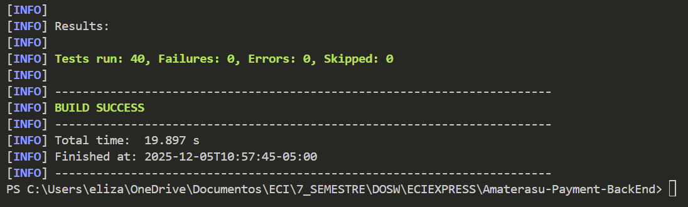

2. **Reporte JaCoCo con cobertura de código**

    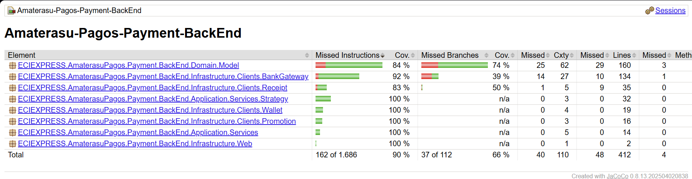

---

### ✅ Criterios de aceptación de pruebas

Para considerar el sistema correctamente probado, se debe cumplir:

- ✅ **Cobertura mínima del 80%** en servicios y lógica de negocio
- ✅ **Todas las pruebas en estado PASSED** (sin fallos)
- ✅ **Cero errores de compilación** en el código de pruebas
- ✅ **Pruebas de casos felices y casos de error** implementadas

---

### 🔄 Integración con CI/CD

Las pruebas se ejecutan automáticamente en cada **push** o **pull request** mediante GitHub Actions:

```yaml
  - name: Build + Test + Coverage
    run: mvn -B clean verify
```

Esto garantiza que ningún cambio roto llegue a producción.

---

## 10. 🗂️ Código de la implementación organizado en las respectivas carpetas

El microservicio de **Pagos de Amaterasu** sigue una **arquitectura hexagonal (puertos y adaptadores)** que separa las responsabilidades en capas bien definidas, promoviendo la escalabilidad, testabilidad y mantenibilidad del código.

---

### 📂 Estructura general del proyecto (Scaffolding)

```
Amaterasu-Payment-BackEnd/
│
├── 📁 src/
│   ├── 📁 main/
│   │   ├── 📁 java/ECIEXPRESS/AmaterasuPagos/Payment/BackEnd/
│   │   │   ├── 📁 Application/                               # 🔵 CAPA DE APLICACIÓN
│   │   │   │   ├── 📁 Dto/
│   │   │   │   ├── 📁 Mappers/
│   │   │   │   ├── 📁 Ports/
│   │   │   │   └── 📁 Services/
│   │   │   │
│   │   │   ├── 📁 Config/                                    # ⚙️ Configuraciones
│   │   │   │
│   │   │   ├── 📁 Domain/                                    # 🟢 CAPA DE DOMINIO
│   │   │   │   ├── 📁 Model/
│   │   │   │   └── 📁 Ports/
│   │   │   │
│   │   │   ├── 📁 Exception/                                 # ⚠️ Manejo de errores
│   │   │   │
│   │   │   ├── 📁 Infrastructure/                            # 🟠 CAPA DE INFRAESTRUCTURA
│   │   │   │   ├── 📁 Clients/
│   │   │   │   └── 📁 Web/
│   │   │   │
│   │   │   └── 📁 Utils/                                     # 🛠️ Utilidades
│   │   │
│   │   └── 📁 resources/                                     # 📄 Archivos de configuración
│   │
│   └── 📁 test/                                              # 🧪 PRUEBAS
│
├── 📁 doc/                                                   # 📚 Documentación
│
├── 📄 Dockerfile
├── 📄 docker-compose.yml
├── 📄 pom.xml
└── 📄 README.md
```

---

> ℹ️ Todo el código fuente está documentado y comentado para facilitar su comprensión, mantenimiento y extensión por parte de cualquier desarrollador.

### 🏛️ Arquitectura Hexagonal Implementada

<div align="center">

| 🎨 **Capa** | 📋 **Responsabilidad** | 🔗 **Dependencias** |
|:-----------|:----------------------|:-------------------|
| **🟢 Domain** | Lógica de negocio pura, entidades (`Payment`, `BankPayment`) y puertos (interfaces) | ❌ Ninguna (independiente) |
| **🔵 Application** | Casos de uso, estrategias de pago (`CashPaymentStrategy`, `BankPaymentStrategy`) y validaciones | ✅ Solo `Domain` |
| **🟠 Infrastructure** | Controladores REST, adaptadores de servicios externos (PayU, Billetera, Promociones, Recibos) | ✅ `Domain` + `Application` |

</div>

**Flujo de dependencias:** `Infrastructure → Application → Domain`

---

### 🎯 Principios de diseño aplicados

<div align="center">

| ✅ **Principio** | 📋 **Implementación** |
|:----------------|:---------------------|
| **Separación de responsabilidades** | Cada capa tiene un propósito único y bien definido |
| **Inversión de dependencias** | Las capas externas dependen de interfaces definidas en el dominio |
| **Independencia del framework** | La lógica de negocio no depende de Spring o MongoDB |
| **Patrón Strategy** | Estrategias intercambiables para diferentes métodos de pago |
| **Testabilidad** | Fácil crear pruebas unitarias mockeando puertos y adaptadores |
| **Mantenibilidad** | Cambios en una capa no afectan a las demás |

</div>  

---

## 11. 🚀 Ejecución del Proyecto

### 📋 Prerrequisitos
- **Java 17**
- **Maven 3.8+**
- **Docker** (Opcional)

### 🛠️ Opción 1: Ejecución Local (Maven)

```bash
# 1. Clonar repositorio
git clone https://github.com/ECIXPRESS/Amaterasu-Payment-BackEnd.git

# 2. Ejecutar aplicación
mvn spring-boot:run
```
📍 **URL Local:** `http://localhost:8085`  
📚 **Documentación API:** `http://localhost:8085/swagger-ui.html`

### 🐳 Opción 2: Ejecución con Docker

```bash
# Levantar el contenedor
docker-compose up --build -d
```

### ⚙️ Configuración
El servicio se conecta por defecto a los otros microservicios en `localhost`. Para cambiar esto, ajusta `application.yml` o usa variables de entorno.

## 12. ☁️ CI/CD y Despliegue en Azure

El proyecto implementa un **pipeline automatizado** con **GitHub Actions** para garantizar la calidad del código y el despliegue continuo en **Azure Cloud**.

---

### 🔗 Enlaces de Despliegue

<div align="center">

| 🌍 Ambiente | 🔗 URL | 📝 Estado |
|:-----------|:-------|:---------|
| **🟢 Producción** | [amaterasu-payment-prod-e4c5eecha5epb0h4.eastus2-01.azurewebsites.net/swagger-ui/index.html ](amaterasu-payment-prod-e4c5eecha5epb0h4.eastus2-01.azurewebsites.net/swagger-ui/index.html ) |  |
| **🟠 Desarrollo** | [amaterasu-payment-dev-fbfdd2bpe9axf3fg.eastus2-01.azurewebsites.net/swagger-ui/index.html ](amaterasu-payment-dev-fbfdd2bpe9axf3fg.eastus2-01.azurewebsites.net/swagger-ui/index.html ) |  |

</div>

---

### 🔄 Pipeline de Automatización

El flujo de trabajo se divide en dos etapas principales:

1. **Integración Continua (CI)**: Se ejecuta en cada *Pull Request*.
   - Compilación del proyecto con Maven.
   - Ejecución de pruebas unitarias y de integración.
   - Análisis de calidad de código con **SonarQube**.
   - Generación de reportes de cobertura con **JaCoCo**.

2. **Despliegue Continuo (CD)**: Se ejecuta al hacer merge a ramas principales.
   - Construcción de la imagen Docker.
   - Publicación de la imagen en **Azure Container Registry (ACR)**.
   - Despliegue automático en **Azure App Service**.
     - `develop` ➔ Ambiente de Desarrollo.
     - `main` ➔ Ambiente de Producción.

---

### ☁️ Infraestructura

<div align="center">

| Componente | Servicio Azure | Propósito |
|:-----------|:---------------|:----------|
| **Compute** |  | Ejecución del contenedor Docker del microservicio. |
| **Storage** |  | Almacenamiento privado de imágenes Docker. |
| **Database** |  | Persistencia de datos transaccionales. |
| **Monitoring** |  | Logs, métricas y trazabilidad en tiempo real. |

</div>

---

### 📊 Evidencias de Despliegue

**Azure Web App - Aplicación en ejecución**

<div align="center">
  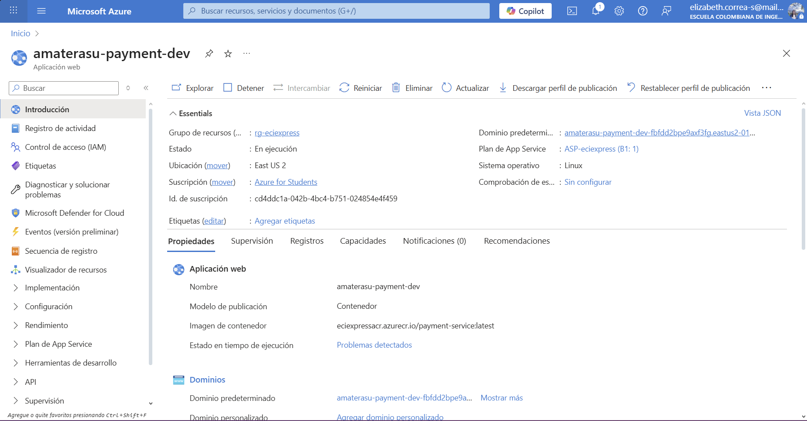

  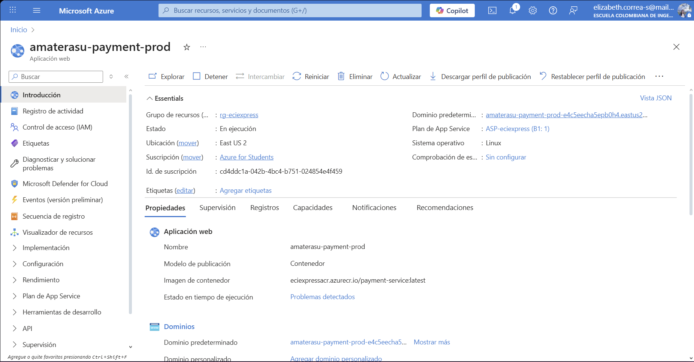
</div>

---

## 13. 🤝 Contribuciones y Metodología

El equipo **Amaterasu** aplicó la metodología **Scrum** con sprints semanales para garantizar una entrega incremental de valor y mejora continua.

### 👥 Equipo Scrum

| Rol | Responsabilidad |
|:---|:---|
| **Product Owner** | Priorización del Backlog y maximización de valor. |
| **Scrum Master** | Facilitador del proceso y eliminación de impedimentos. |
| **Developers** | Diseño, implementación y pruebas de funcionalidades. |

### 🔄 Eventos y Artefactos

- **Sprints Semanales**: Ciclos cortos de desarrollo.
- **Daily Scrum**: Sincronización diaria (15 min).
- **Sprint Review & Retrospective**: Demostración de incrementos y mejora de procesos.
- **Backlogs**: Gestión de tareas en Jira/GitHub Projects.

### 🎯 Valores del Equipo
Compromiso, Coraje, Enfoque, Apertura y Respeto fueron los pilares para afrontar desafíos técnicos como la integración con pasarelas de pago.

---

<div align="center">

### 🏆 Equipo **Amaterasu**


> 💡 **ECIEXPRESS - Microservicio de Pagos** es un proyecto académico, pero su arquitectura y calidad están pensadas para ser escalables y adaptables a escenarios reales en instituciones educativas.

**🎓 Escuela Colombiana de Ingeniería Julio Garavito**

</div>

---


